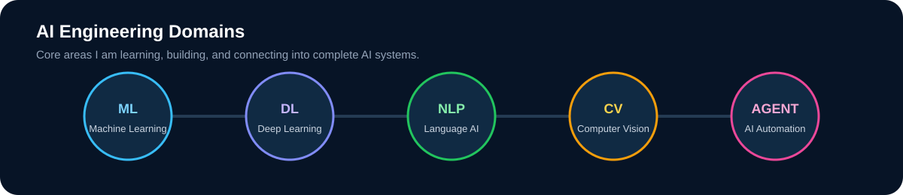
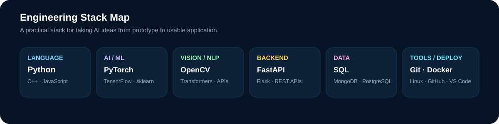

  

  <b>AI / Machine Learning Developer building practical intelligent systems.</b> 
  Focused on AI assistants, automation, computer vision, NLP, and Python-based ML engineering.

  
  
  

---

## Featured Projects

<table>
<tr>
<td width="50%" valign="top">

### 🤖 AI PC Assistant
A voice-controlled personal-computer assistant designed to automate everyday desktop tasks such as opening applications, managing files, cleaning temporary files, and executing safe system actions.

**Core ideas:** Python · Voice Commands · Automation · AI Assistant

**Status:** Currently building

</td>
<td width="50%" valign="top">

### ⚡ ARROWSTACK
One of my public development projects, focused on building and shipping practical software.

<a href="https://github.com/azhar-data/ARROWSTACK"><b>View repository →</b></a>

</td>
</tr>

<tr>
<td width="50%" valign="top">

### 🌐 Portfolio
My public portfolio project showcasing my work, development journey, and projects.

<a href="https://github.com/azhar-data/Portfolio"><b>View repository →</b></a>

</td>
<td width="50%" valign="top">

### 🧠 More AI Projects
I am actively building projects across machine learning, computer vision, NLP, AI assistants, and automation.

**More projects coming soon.**

</td>
</tr>
</table>

---

## AI Engineering Domains

  

---

## Engineering Stack

  

### Languages, Frameworks & Tools

  

---

## What I Focus On

<table>
<tr>
<td width="50%" valign="top">

### 🧠 Applied AI
Building AI systems that solve real problems rather than stopping at notebooks or model experiments.

</td>
<td width="50%" valign="top">

### 🤖 Intelligent Automation
Combining AI with desktop workflows, APIs, tools, and system actions to reduce repetitive work.

</td>
</tr>
<tr>
<td width="50%" valign="top">

### 📦 End-to-End ML
Data preparation → training → evaluation → API/application integration → deployment.

</td>
<td width="50%" valign="top">

### 📚 Continuous Learning
Strengthening machine-learning foundations while shipping increasingly complete AI projects.

</td>
</tr>
</table>

---

## GitHub Activity

  
  

  

---

## Currently Building

> **AI PC Assistant** — a practical voice-driven assistant for personal-computer control and everyday automation.

Current direction:

- Voice-to-command pipeline
- Intent recognition
- Safe command execution
- File and temporary-file management
- App launching and desktop automation
- Modular skills / tools architecture
- Optional LLM integration for natural-language commands

---

## Connect

  <a href="https://github.com/azhar-data">GitHub</a>
  &nbsp;•&nbsp;
  <a href="mailto:azhararain8012@gmail.com">Email</a>
  &nbsp;•&nbsp;
  <a href="https://github.com/azhar-data/Portfolio">Portfolio</a>

  Building useful AI, one project at a time.

